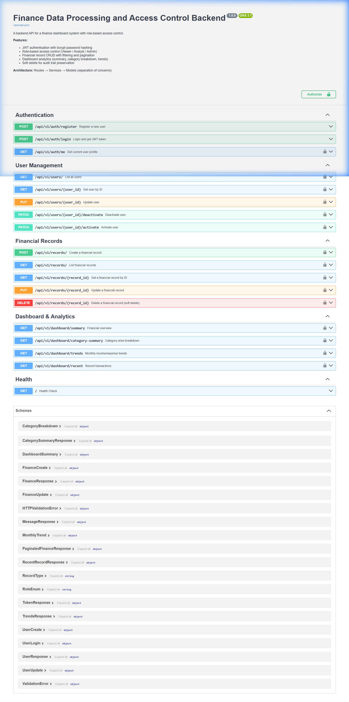

# Finance Data Processing and Access Control Backend

A robust backend API for a finance dashboard system with role-based access control, built with **Python**, **FastAPI**, **SQLAlchemy**, and **SQLite**.

## Table of Contents

- [Overview](#overview)
- [Tech Stack](#tech-stack)
- [Architecture](#architecture)
- [Setup & Installation](#setup--installation)
- [Running the Server](#running-the-server)
- [Running Tests](#running-tests)
- [Default Admin Account](#default-admin-account)
- [API Reference](#api-reference)
- [Role-Based Access Control](#role-based-access-control)
- [Database Schema](#database-schema)
- [Design Decisions & Assumptions](#design-decisions--assumptions)
- [Error Handling](#error-handling)
- [Configuration](#configuration)
- [Optional Enhancements Implemented](#optional-enhancements-implemented)

---

## Overview

This backend powers a finance dashboard where users interact with financial records based on their assigned role. The system supports:

- **User management** with registration, authentication, and role assignment
- **Financial record CRUD** with filtering, pagination, and soft-delete
- **Dashboard analytics** including summaries, category breakdowns, monthly trends, and recent activity
- **Role-based access control** enforced at the API layer via middleware dependencies
- **Comprehensive test suite** with 44 test cases using pytest

---

## Tech Stack

| Component | Technology | Rationale |
|-----------|------------|-----------|
| **Language** | Python 3.10+ | Clean, expressive, excellent ecosystem |
| **Framework** | FastAPI | Async-capable, automatic OpenAPI docs, dependency injection |
| **ORM** | SQLAlchemy | Mature, flexible, clean declarative models |
| **Database** | SQLite | Zero-config, file-based, ideal for development |
| **Auth** | JWT (python-jose) | Stateless, scalable, industry standard |
| **Passwords** | bcrypt (passlib) | Adaptive hashing, resistant to brute force |
| **Validation** | Pydantic v2 | Tight FastAPI integration, type-safe schemas |
| **Testing** | pytest + httpx | FastAPI TestClient with isolated test database |

---

## Architecture

The application follows a **layered architecture** with clear separation of concerns:

```
Request → Routes (HTTP) → Services (Business Logic) → Models (Database)
```

```
Finance Backend Assignment/
├── app/
│   ├── __init__.py
│   ├── config.py             # Centralized configuration (env vars)
│   ├── main.py               # App entry point, middleware, error handlers
│   ├── database.py           # SQLAlchemy engine and session management
│   ├── models/               # Database models (ORM)
│   │   ├── user.py           # User model with roles and status
│   │   └── finance.py        # FinanceRecord model with soft delete
│   ├── schemas/              # Pydantic schemas (validation/serialization)
│   │   ├── user_schema.py    # User request/response schemas
│   │   └── finance_schema.py # Finance + dashboard analytics schemas
│   ├── services/             # Business logic layer
│   │   ├── user_service.py   # User auth and management logic
│   │   └── finance_service.py# Record CRUD and analytics logic
│   ├── routes/               # HTTP handlers (thin controllers)
│   │   ├── auth_routes.py    # Register, login, profile
│   │   ├── user_routes.py    # Admin user management
│   │   ├── finance_routes.py # Financial record CRUD
│   │   └── dashboard_routes.py # Analytics endpoints
│   └── utils/                # Cross-cutting concerns
│       └── security.py       # JWT, bcrypt, auth dependencies, RBAC
├── tests/                    # Pytest test suite
│   ├── conftest.py           # Fixtures, test DB setup
│   ├── test_auth.py          # Authentication tests
│   ├── test_records.py       # Financial records tests
│   └── test_dashboard.py     # Dashboard analytics tests
├── docs/                     # API documentation
│   ├── swagger.json          # OpenAPI 3.1 specification
│   └── swagger-ui.png        # Swagger UI screenshot
├── .env.example              # Environment variable template
├── .gitignore
├── requirements.txt
└── README.md
```

**Layer responsibilities:**
- **Routes** — Handle HTTP request/response, input parsing, status codes. No business logic.
- **Services** — Contain all business rules, data validation, and data access patterns. Framework-agnostic.
- **Models** — Define database schema, relationships, and constraints.
- **Schemas** — Define API contracts (request validation + response serialization).
- **Utils** — Cross-cutting concerns like authentication and authorization.

---

## Setup & Installation

### Prerequisites

- Python 3.10 or higher
- pip (Python package manager)

### Steps

```bash
# 1. Clone the repository
git clone <repo-url>
cd "Finance Backend Assignment"

# 2. Create a virtual environment (recommended)
python -m venv venv
venv\Scripts\activate        # Windows
# source venv/bin/activate   # macOS/Linux

# 3. Install dependencies
pip install -r requirements.txt

# 4. (Optional) Create a .env file from the template
copy .env.example .env       # Windows
# cp .env.example .env       # macOS/Linux
```

---

## Running the Server

```bash
python -m uvicorn app.main:app --reload
```

The server starts at `http://localhost:8000`.

| URL | Description |
|-----|-------------|
| `http://localhost:8000` | Health check endpoint |
| `http://localhost:8000/docs` | **Swagger UI** — interactive API documentation |
| `http://localhost:8000/redoc` | ReDoc — alternative API documentation |

---

## API Documentation (Swagger)

The API is fully documented using the OpenAPI 3.1 specification. Interactive documentation is auto-generated by FastAPI.

**When running locally:**
- **Swagger UI** (interactive): `http://localhost:8000/docs`
- **ReDoc** (readable): `http://localhost:8000/redoc`

**Without running the server:**
- The exported OpenAPI spec is available at [`docs/swagger.json`](docs/swagger.json)
- Import it into [Swagger Editor](https://editor.swagger.io), [Postman](https://www.postman.com), or any OpenAPI-compatible tool

**Swagger UI Preview:**



---

## Running Tests

```bash
pytest -v
```

The test suite uses an **isolated test database** (`test_finance.db`) that is automatically created and cleaned up. Tests cover:

- **Authentication** — registration, login, validation, error handling
- **Financial Records** — CRUD, access control, filtering, pagination, soft delete
- **Dashboard Analytics** — all summary endpoints with calculation verification
- **Input Validation** — negative amounts, invalid types, blank fields, missing data
- **Access Control** — all three roles tested against every endpoint

---

## Default Admin Account

On first startup, the system creates a default admin user:

| Field | Value |
|-------|-------|
| **Email** | `admin@finance.com` |
| **Password** | `admin123` |
| **Role** | `admin` |

> **Important:** Change these credentials via environment variables in production.

---

## API Reference

All endpoints are prefixed with `/api/v1`.

### Authentication (`/api/v1/auth`)

| Method | Endpoint | Auth | Description |
|--------|----------|------|-------------|
| `POST` | `/auth/register` | Public | Register a new user |
| `POST` | `/auth/login` | Public | Login and get JWT token |
| `GET` | `/auth/me` | Required | Get current user profile |

#### Register Example
```bash
curl -X POST http://localhost:8000/api/v1/auth/register \
  -H "Content-Type: application/json" \
  -d '{"name": "John Doe", "email": "john@example.com", "password": "securepass", "role": "viewer"}'
```

#### Login Example
```bash
curl -X POST http://localhost:8000/api/v1/auth/login \
  -H "Content-Type: application/json" \
  -d '{"email": "admin@finance.com", "password": "admin123"}'

# Response:
# {"access_token": "eyJhbGci...", "token_type": "bearer", "user": {...}}
```

### User Management (`/api/v1/users`) — Admin Only

| Method | Endpoint | Description |
|--------|----------|-------------|
| `GET` | `/users/` | List users (paginated, filterable) |
| `GET` | `/users/{id}` | Get user details |
| `PUT` | `/users/{id}` | Update user (name, role, status) |
| `PATCH` | `/users/{id}/deactivate` | Deactivate user account |
| `PATCH` | `/users/{id}/activate` | Reactivate user account |

### Financial Records (`/api/v1/records`)

| Method | Endpoint | Auth | Description |
|--------|----------|------|-------------|
| `POST` | `/records/` | Admin | Create a record |
| `GET` | `/records/` | Any | List records (filtered, paginated) |
| `GET` | `/records/{id}` | Any | Get a single record |
| `PUT` | `/records/{id}` | Admin | Update a record |
| `DELETE` | `/records/{id}` | Admin | Soft-delete a record |

**Filtering query parameters for `GET /records/`:**

| Parameter | Type | Description |
|-----------|------|-------------|
| `type` | string | `income` or `expense` |
| `category` | string | Partial match (case-insensitive) |
| `date_from` | date | Start date (YYYY-MM-DD, inclusive) |
| `date_to` | date | End date (YYYY-MM-DD, inclusive) |
| `page` | int | Page number (default: 1) |
| `per_page` | int | Results per page (default: 10, max: 100) |

### Dashboard Analytics (`/api/v1/dashboard`) — Any Authenticated User

| Method | Endpoint | Description |
|--------|----------|-------------|
| `GET` | `/dashboard/summary` | Total income, expenses, net balance, count |
| `GET` | `/dashboard/category-summary` | Category-wise income/expense breakdown |
| `GET` | `/dashboard/trends?months=12` | Monthly income/expense trends |
| `GET` | `/dashboard/recent?limit=10` | Most recent transactions |

#### Summary Response
```json
{"total_income": 25000.0, "total_expenses": 12000.0, "net_balance": 13000.0, "total_records": 42}
```

#### Category Summary Response
```json
{
  "categories": [
    {"category": "Salary", "total_income": 25000.0, "total_expense": 0.0, "net": 25000.0},
    {"category": "Rent", "total_income": 0.0, "total_expense": 8000.0, "net": -8000.0}
  ]
}
```

---

## Role-Based Access Control

The system enforces three roles with clear permission boundaries:

| Action | Viewer | Analyst | Admin |
|--------|--------|---------|-------|
| Register & Login | Yes | Yes | Yes |
| View own profile | Yes | Yes | Yes |
| View records | Yes | Yes | Yes |
| View dashboard | Yes | Yes | Yes |
| Create records | No | No | Yes |
| Update records | No | No | Yes |
| Delete records | No | No | Yes |
| Manage users | No | No | Yes |

**Implementation:** Access control uses a reusable `RoleChecker` dependency class (`utils/security.py`). Each route declares its required roles via FastAPI's dependency injection. Unauthorized access returns `403 Forbidden` with a descriptive error message.

**Self-protection guards:** Admins cannot deactivate their own account or change their own role, preventing accidental lockout.

---

## Database Schema

### Users Table

| Column | Type | Constraints |
|--------|------|-------------|
| `id` | Integer | Primary Key, Auto-increment |
| `name` | String(100) | Not Null |
| `email` | String(255) | Unique, Not Null, Indexed |
| `hashed_password` | String(255) | Not Null (bcrypt hash) |
| `role` | String(20) | Not Null, Default: "viewer" |
| `is_active` | Boolean | Not Null, Default: True |
| `created_at` | DateTime | Not Null, Auto-set |

### Finance Records Table

| Column | Type | Constraints |
|--------|------|-------------|
| `id` | Integer | Primary Key, Auto-increment |
| `amount` | Float | Not Null, Must be > 0 |
| `type` | String(20) | Not Null, Indexed (income/expense) |
| `category` | String(100) | Not Null, Indexed |
| `date` | Date | Not Null, Indexed |
| `notes` | String(500) | Nullable |
| `created_by` | Integer | Foreign Key → users.id |
| `is_deleted` | Boolean | Not Null, Default: False (soft delete) |
| `created_at` | DateTime | Not Null, Auto-set |
| `updated_at` | DateTime | Not Null, Auto-updated |

---

## Design Decisions & Assumptions

### Architectural Decisions

1. **Services layer:** Business logic is separated from route handlers into dedicated service classes (`UserService`, `FinanceService`). Routes are thin HTTP adapters. This improves testability, reusability, and maintainability.

2. **SQLite over PostgreSQL:** Chosen for zero-config simplicity. The schema is fully compatible with PostgreSQL — switching requires only changing `DATABASE_URL` in the config.

3. **Soft delete over hard delete:** Financial records are marked as deleted (`is_deleted = True`) rather than removed. This preserves audit trails and prevents accidental data loss.

4. **RoleChecker as a callable class:** Using a parameterized dependency class allows each endpoint to cleanly declare its required roles without code duplication.

5. **Centralized configuration:** All settings are externalized to `config.py` which reads from environment variables. No secrets are hardcoded.

6. **Pydantic field aliases:** Fields named `type` and `date` conflict with Python builtins in Pydantic v2. Using aliases (`record_type` / `record_date` internally, `type` / `date` in JSON) resolves this while keeping the API clean.

### Assumptions

1. **Single-tenant:** All users share the same financial records. Records are not scoped per-user for viewing (only for creation attribution).

2. **Public registration:** Any user can register with any role. In production, admin role assignment would require an existing admin's approval.

3. **Transaction dates:** Monthly trends use the record's `date` field (when the transaction occurred), not `created_at` (when it was entered).

4. **Category matching:** Category filter uses case-insensitive partial matching for flexibility.

---

## Error Handling

The API returns consistent, structured error responses across all endpoints:

| Status | When | Example |
|--------|------|---------|
| `422` | Validation failure | Negative amount, invalid email, missing fields |
| `401` | Invalid/expired token | Bad JWT, expired session |
| `403` | Insufficient permissions | Viewer trying to create records |
| `404` | Resource not found | Non-existent record or user ID |
| `409` | Conflict | Duplicate email registration |
| `500` | Server error | Unhandled exceptions (no stack trace leaked) |

### Validation Error Example (422)
```json
{
  "detail": "Validation failed",
  "errors": [
    {"field": "body → amount", "message": "Input should be greater than 0", "type": "greater_than"}
  ]
}
```

### Access Denied Example (403)
```json
{"detail": "Access denied. Required role(s): admin. Your role: viewer", "status_code": 403}
```

---

## Configuration

All settings are configurable via environment variables (see `.env.example`):

| Variable | Default | Description |
|----------|---------|-------------|
| `DATABASE_URL` | `sqlite:///./finance.db` | Database connection string |
| `SECRET_KEY` | (dev default) | JWT signing secret — **change in production** |
| `ACCESS_TOKEN_EXPIRE_HOURS` | `24` | Token validity period |
| `DEFAULT_ADMIN_EMAIL` | `admin@finance.com` | Seeded admin email |
| `DEFAULT_ADMIN_PASSWORD` | `admin123` | Seeded admin password |
| `CORS_ORIGINS` | `*` | Allowed CORS origins (comma-separated) |

---

## Optional Enhancements Implemented

| Enhancement | Status | Details |
|-------------|--------|---------|
| JWT Authentication | Implemented | Stateless tokens with bcrypt password hashing |
| Pagination | Implemented | All list endpoints support `page` and `per_page` |
| Search/Filtering | Implemented | Records filterable by type, category, date range |
| Soft Delete | Implemented | Records are flagged, not removed |
| Unit Tests | Implemented | 44 tests with pytest (auth, CRUD, RBAC, analytics) |
| API Documentation | Implemented | Auto-generated Swagger UI + ReDoc |
| CORS Support | Implemented | Configurable via environment variables |
| Admin Seeding | Implemented | Default admin created on first startup |
| Input Validation | Implemented | Pydantic schemas with custom validators |
| Error Handling | Implemented | Global handlers, consistent JSON format |
| Configuration | Implemented | Environment variable based, `.env.example` provided |
| .gitignore | Implemented | Comprehensive exclusion rules |

---

## License

This project was developed as part of an internship assessment.
